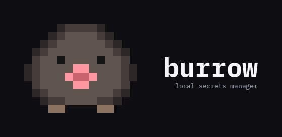

<p align="center">
  
</p>

<p align="center">
  <a href="https://github.com/usealtoal/burrow/actions"></a>
  <a href="https://crates.io/crates/burrow"></a>
  <a href="LICENSE-MIT"></a>
</p>

<p align="center">
  <strong>A local secrets manager for development teams, written in Rust.</strong>
</p>

## Highlights

- **Encrypted at rest** — age encryption by default, optional support for AWS KMS, GCP KMS, and GPG
- **Vendor-agnostic** — no cloud lock-in, works with any git host and any infrastructure
- **Team-friendly** — add members, share secrets, rotate keys, all through git
- **Fast** — encrypts in ~100µs, single binary, no runtime dependencies
- **Zero config** — `burrow init` and start adding secrets
- **Auto-detect** — `burrow .` detects your stack and runs with secrets injected
- **No server required** — secrets live in your repo, encrypted
- **Language-agnostic** — works with Python, Node, Rust, Go, Docker, and anything else

## Installation

```bash
# Cargo
cargo install burrow

# From source
git clone https://github.com/usealtoal/burrow && cd burrow
cargo install --path .
```

## Quick Start

```bash
# One-time identity setup
burrow setup

# Initialize in your project
cd my-app
burrow init

# Add secrets
burrow set DATABASE_URL postgres://localhost/db
burrow set STRIPE_KEY sk_live_xxx

# Run your app with secrets
burrow .
```

## Team Workflow

```bash
# Alice creates the project
burrow init
burrow set API_KEY sk_live_xxx
git add .burrow.toml && git commit -m "init vault" && git push

# Bob clones and requests access
git clone ... && cd project
burrow knock
git add .burrow/requests/ && git commit -m "request access" && git push

# Alice approves
git pull
burrow admit bob
git commit -am "grant bob access" && git push

# Bob pulls and runs
git pull
burrow .
```

No Slack DMs. No shared password vaults. No `.env` files in git history. Access requests and approvals are git commits.

## Commands

| Command | Description |
|---------|-------------|
| `burrow setup` | Generate global identity |
| `burrow init` | Initialize vault in current directory |
| `burrow set KEY VALUE` | Set a secret |
| `burrow get KEY` | Get a secret value |
| `burrow add KEY` | Add a secret interactively |
| `burrow list` | List all secret keys |
| `burrow rm KEY` | Remove a secret |
| `burrow .` | Auto-detect project and run with secrets |
| `burrow run -- CMD` | Run a command with secrets injected |
| `burrow knock` | Request vault access |
| `burrow admit NAME` | Approve an access request |
| `burrow pending` | List pending requests |
| `burrow team add/rm/list` | Manage team members |
| `burrow secrets diff` | Compare vault and .env |
| `burrow secrets rotate` | Rotate encryption keys |
| `burrow secrets lock/unlock` | Lock or decrypt secrets |
| `burrow secrets import/export` | Import or export .env files |
| `burrow check status` | Vault overview |
| `burrow check audit` | Audit for leaked secrets |

## Cipher Backends

| Backend | Flag | Use Case |
|---------|------|----------|
| **age** (default) | — | Local development, small teams |
| AWS KMS | `--features aws` | AWS infrastructure, compliance requirements |
| GCP KMS | `--features gcp` | Google Cloud infrastructure |
| GPG | `--features gpg` | Legacy systems, existing GPG workflows |

```bash
# Install with AWS KMS support
cargo install burrow --features aws

# Initialize with a specific backend
burrow init --cipher aws-kms --kms-key arn:aws:kms:us-east-1:...
```

## Benchmarks

Measured with [Criterion](https://github.com/bheisler/criterion.rs). See [BENCHMARKS.md](BENCHMARKS.md) for methodology.

| Operation | 32B | 4KB | 16KB |
|-----------|-----|-----|------|
| Encrypt | 105µs | 113µs | 138µs |
| Decrypt | 135µs | 154µs | 195µs |
| Roundtrip | 258µs | 271µs | 355µs |

## Contributing

See [CONTRIBUTING.md](CONTRIBUTING.md) for setup and guidelines.

## License

Licensed under either of:

- [MIT License](LICENSE-MIT)
- [Apache License, Version 2.0](LICENSE-APACHE)

at your option.
